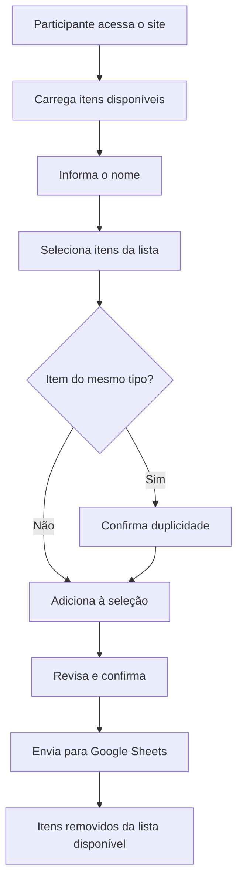

# ☕ Café da Manhã — Consagração

Aplicação web para organizar as contribuições de um café da manhã. Os participantes informam o nome, selecionam os itens que desejam levar e a escolha é registrada automaticamente em uma planilha Google Sheets.

---

## Funcionalidades

- **Lista dinâmica de itens** — carrega em tempo real apenas os itens ainda disponíveis na planilha
- **Organização por categorias** — Pães & Bolos, Frios & Laticínios, Frutas, Bebidas, Geleias & Doces, Salgados e Outros
- **Seleção intuitiva** — chips clicáveis com preview dos itens escolhidos
- **Item personalizado** — campo para contribuir com algo que não está na lista
- **Alerta de duplicidade** — avisa quando o participante seleciona itens do mesmo tipo (ex.: dois tipos de pão)
- **Resumo antes do envio** — modal de confirmação com totais agrupados por tipo
- **Interface responsiva** — pensada para uso no celular durante o evento

---

## Tecnologias

| Camada        | Tecnologia                          |
|---------------|-------------------------------------|
| Frontend      | HTML, CSS e JavaScript (vanilla)    |
| Backend       | Google Apps Script (Web App)        |
| Banco de dados| Google Sheets                       |
| Hospedagem    | GitHub Pages                        |
| Fontes        | [Inter](https://fonts.google.com/specimen/Inter) (Google Fonts) |

Não há processo de build: o projeto é uma página estática servida diretamente pelo `index.html`.

---

## Estrutura do projeto

```
cafe-consagracao/
├── index.html      # Aplicação completa (HTML, CSS e JS)
├── CNAME           # Domínio customizado para GitHub Pages
├── package.json    # Scripts de desenvolvimento local
└── README.md
```

---

## Desenvolvimento local

### Pré-requisitos

- [Node.js](https://nodejs.org/) (opcional, apenas para o servidor de desenvolvimento)

### Executar

```bash
# Instalar dependências (opcional)
npm install

# Iniciar servidor local com live reload
npm run dev
```

O comando `npm run dev` usa o [live-server](https://www.npmjs.com/package/live-server) e abre a aplicação no navegador, geralmente em `http://127.0.0.1:8080`.

> **Nota:** para testar o carregamento e envio de dados, é necessário configurar o backend do Google Apps Script (veja abaixo).

---

## Configuração do backend (Google Sheets)

A aplicação se comunica com um **Google Apps Script** publicado como Web App. O endpoint está definido na variável `SCRIPT_URL` dentro do `index.html`.

### O que o script precisa fazer

| Ação        | Método | Parâmetros                          | Resposta / Comportamento        |
|-------------|--------|-------------------------------------|---------------------------------|
| Listar itens| `GET`  | `?action=getItems`                  | JSON com array de `{ nome }`    |
| Registrar   | `POST` | `nome` (string), `itens` (JSON)     | Salva na planilha e remove os itens escolhidos da lista disponível |

### Passos para configurar

1. Crie uma planilha Google Sheets com a lista de itens disponíveis
2. Crie um projeto no [Google Apps Script](https://script.google.com/) vinculado à planilha
3. Implemente as ações `getItems` (GET) e o registro de contribuições (POST)
4. Publique como **Web App** com acesso "Qualquer pessoa"
5. Copie a URL gerada e substitua o valor de `SCRIPT_URL` no `index.html`:

```javascript
var SCRIPT_URL = 'https://script.google.com/macros/s/SEU_SCRIPT_ID/exec';
```

---

## Deploy no GitHub Pages

1. Faça push do repositório para o GitHub
2. Em **Settings → Pages**, configure a branch de publicação (ex.: `main`)
3. Para domínio customizado, mantenha o arquivo `CNAME` na raiz com o domínio desejado:

```
consagracao.invbotafogo.com.br
```

4. Configure o registro DNS do domínio apontando para o GitHub Pages

---

## Fluxo de uso



---

## Licença

Este projeto está sob a licença ISC.
